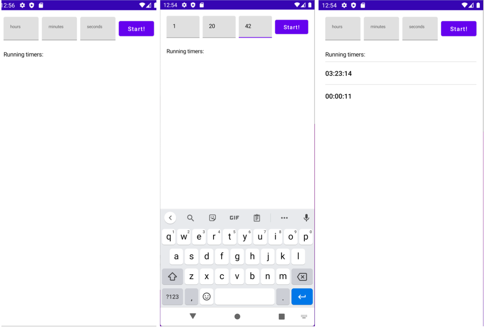

# Aevum
### A timer app
## Requirements:

● User can define count-down timers using three inputs: hours, minutes and seconds.

● User can start the previously defined timer using the “Start” button.

● When a timer is started, it is added to the top of the list and the inputs are cleared.

● Timer is presented in the format: HH:MM:SS.

● Application can be used in landscape or portrait mode.

## Hints
You should think of it as a larger, expandable team project, with more features, views and components being added in the future. In other words, try to express your thinking about the broader project architecture, but only include the code/assets relevant to the requirements.

● Please use Kotlin for this exercise.

● The UI has been prepared for you. Feel free to modify the existing code.

● We appreciate incremental commits.

● We appreciate unit & UI tests or at the very least a code that can be easily unit
tested.

● We appreciate simplicity, efficiency, correctness and architecture.

Good luck and have fun!
